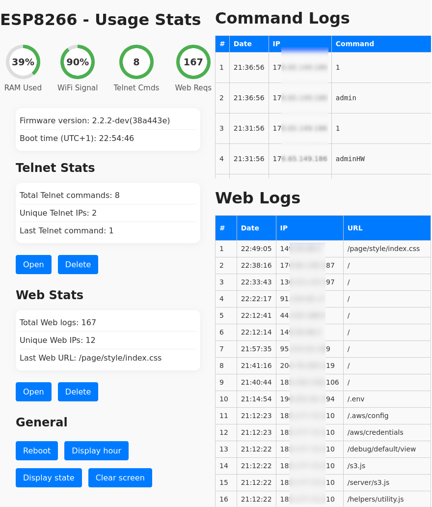

# ESP8266 Honeypot

## Features

- Fake Telnet server (single session, drops after 10s if a new client connects)
- Fake web server simulating sensitive endpoints
- Logs Telnet commands and web accesses
- Web admin interface for log viewing/clearing, stats, and OLED control
- OLED status display (time, stats, last event)
- Records suspicious connections (IP, time, command)

## Required Libraries

Install these libraries in the Arduino IDE Library Manager or via PlatformIO:

- `ESP8266WiFi`  
- `ESP8266WebServer`  
- `WiFiUdp`  
- `NTPClient`  
- `TelnetStream`  
- `Wire`  
- `Adafruit_GFX`  
- `Adafruit_SSD1306`  

## Configuration

Edit `config.h` with your settings:

- **WiFi**
  - `WIFI_SSID`: WiFi network name
  - `WIFI_PASSWD`: WiFi password

- **Network**
  - `localIP`, `gateway`, `subnet`, `dns`: static IP configuration

- **Web & Telnet**
  - `PORT_WEB_ADMIN`: admin web server port (e.g., 8080)
  - `PORT_WEB_HONEYPOT`: fake web server port (e.g., 80)
  - `PORT_TELNET`: telnet port (e.g., 23)
  - `HTTP_AUTH_USERNAME`, `HTTP_AUTH_PASSWD`: web admin credentials

- **NTP**
  - `NTP_POOL`: NTP pool server
  - `NTP_SHIFT`: time zone offset
  - `NTP_UPDATE_DELAY`: NTP update interval

- **Misc**
  - `CMD_BLACKLIST`, `WEB_BLACKLIST`: ignored commands/URLs for logs
  - `DISPLAY_UPDATE_INTERVAL`: OLED refresh rate

## Installation

1. Set up your parameters in `config.h`.
2. Flash the firmware to an ESP8266.
3. Access the admin web interface on the configured port.

